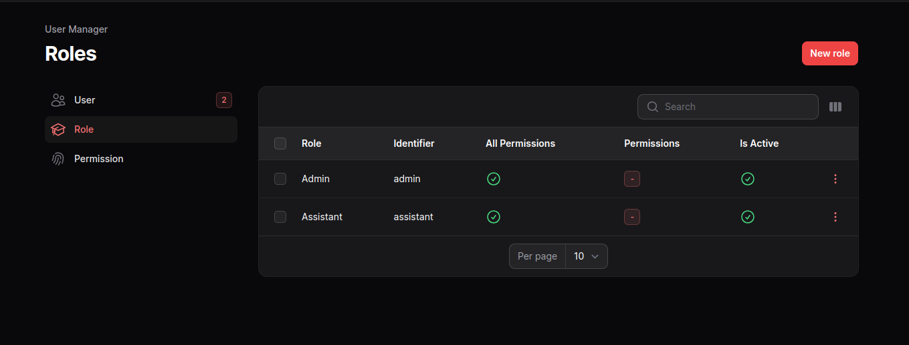

# Filament Users Roles Permissions

Filament User & Roles & Permissions.
## Installation

Install Using Composer

```
composer require cwsps154/filament-users-roles-permissions

```
In this package we use [Laravel-medialibrary](https://spatie.be/docs/laravel-medialibrary/v10/introduction) package for profile image, so you have to publish it migrations file
```
php artisan vendor:publish --provider="Spatie\MediaLibrary\MediaLibraryServiceProvider" --tag="migrations"
```
Run

```
php artisan filament-users-roles-permissions:install
```

## Usage/Examples

Add this into your Filament `PannelProvider` class `panel()`
```
$panel->plugins([FilamentUsersRolesPermissionsPlugin::make()]);
```
Add the `CWSPS154\FilamentUsersRolesPermissions\Models\HasRole` `trait` in `User` Model
```
use HasRole;
```

And the `User` model should `implements` these `interfaces`'s `Spatie\MediaLibrary\HasMedia`, `Filament\Models\Contracts\HasAvatar` and `Filament\Models\Contracts\FilamentUser`

```
implements HasMedia, HasAvatar, FilamentUser
```
Also don't forget add these in you User model
```
    /**
     * The attributes that are mass assignable.
     *
     * @var array<int, string>
     */
    protected $fillable = [
        'name',
        'email',
        'mobile',
        'password',
        'role_id',
        'last_seen',
        'is_active'
    ];

    /**
     * The attributes that should be hidden for serialization.
     *
     * @var array<int, string>
     */
    protected $hidden = [
        'password',
        'remember_token',
    ];

    /**
     * Get the attributes that should be cast.
     *
     * @return array<string, string>
     */
    protected function casts(): array
    {
        return [
            'email_verified_at' => 'datetime',
            'password' => 'hashed',
            'last_seen' => 'datetime',
            'is_active' => 'boolean',
        ];
    }
```

By default, you will get the user which have `email` `admin@gmail.com` & `password` `admin@123`.

Use this middleware in your `authMiddleware([])` section
```
HaveAccess::class,
IsActive::class,
IsOnline::class,
```
You can restrict the access of each Menu By applying any of the `Gate::define` `ability` and `arguments` or you can pass `true/false` or any `Closure`
```
FilamentUsersRolesPermissionsPlugin::make()
                        ->canViewAnyUser('have-access', 'view-user')
                        ->canCreateUser('have-access', 'create-user')
                        ->canEditUser('have-access', 'edit-user')
                        ->canDeleteUser('have-access', 'delete-user')
                        ->canViewAnyRole('have-access', 'view-role')
                        ->canCreateRole('have-access', 'create-role')
                        ->canEditRole('have-access', 'edit-role')
                        ->canDeleteRole('have-access', 'delete-role')
                        ->canViewAnyPermission('have-access', 'view-permission')
                        ->canCreatePermission('have-access', 'create-permission')
                        ->canEditPermission('have-access', 'edit-permission')
                        ->canDeletePermission('have-access', 'delete-permission'),
```
Behind hoods, we're using one Gate 'have-access' ,here it will check the current user have the role which have the permission.

```
Gate::allows('have-access', '<the identifer from the permission>')
```

Note: For the user which is_admin user have all permission by default. 

While Creating the permission there is field for `route`, you can put the `route name` if the permission have it, otherwise make it blank.

```
php artisan route:list
```
This will show you all the route's name.

You can publish the config file `filament-users-roles-permissions.php`, by running this command

```
php artisan vendor:publish --tag=filament-users-roles-permissions-config
```

which contains these settings

```
[
    'user_manager' => [
        'layout' => null,
        'navigation' => [
            'group' => 'filament-users-roles-permissions::users-roles-permissions.system',
            'label' => 'filament-users-roles-permissions::users-roles-permissions.user.manager',
            'icon' => 'heroicon-o-user-group',
            'sort' => 100,
        ],
        'user_resource' => [
            'layout' => null,
            'navigation' => [
                'group' => null,
                'label' => 'filament-users-roles-permissions::users-roles-permissions.user.resource.user',
                'icon' => 'heroicon-o-users',
                'sort' => 1,
            ]
        ],
        'role_resource' => [
            'layout' => null,
            'navigation' => [
                'group' => null,
                'label' => 'filament-users-roles-permissions::users-roles-permissions.role.resource.role',
                'icon' => 'heroicon-o-academic-cap',
                'sort' => 2,
            ]
        ],
        'permission_resource' => [
            'layout' => null,
            'navigation' => [
                'group' => null,
                'label' => 'filament-users-roles-permissions::users-roles-permissions.permission.resource.permission',
                'icon' => 'heroicon-o-finger-print',
                'sort' => 3,
            ]
        ]
    ]
];
```

## Screenshots





